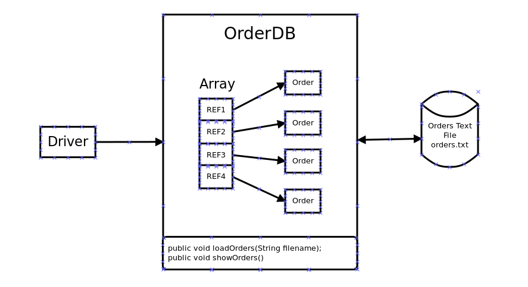

## CSCE 10204: Assignment Four - Orders Database and Report


### Instructions

Using the starter Eclipse Project, implement the **OrderDB** class which manages an **array of Order objects**. Create an **Order.class** with set/get methods and constructors.  Each instance of the Order class holds one Order record from the file, **orders.txt**. The orders text file (**orders.txt**) contains the 50 example orders with a header record at the top of the file.

```java
    void loadOrders(String fileName);
    void showOrders();
```
The **loadOrders()** should load the file contents into an array(**Not an ArrayList**) of **Order** objects. 



The report output created from your **showOrders()** implementation should look **EXACTLY** like the following:

```
Order ID Product                         Total Amt
-------- -------                         ---------
1001     Mechanical Keyboard                263.42
1002     Mechanical Keyboard                220.60
1003     Mechanical Keyboard                185.88
1004     HD Monitor 27                      777.70
1005     Wireless Mouse                     497.76
1006     HD Monitor 27                      147.72
1007     Noise Canceling Headphones         518.05
1008     Mechanical Keyboard                165.60
1009     Noise Canceling Headphones         397.10
1010     HD Monitor 27                     1035.15
1011     Mechanical Keyboard                432.48
1012     Noise Canceling Headphones         255.54
1013     USB-C Hub                         1296.30
```
